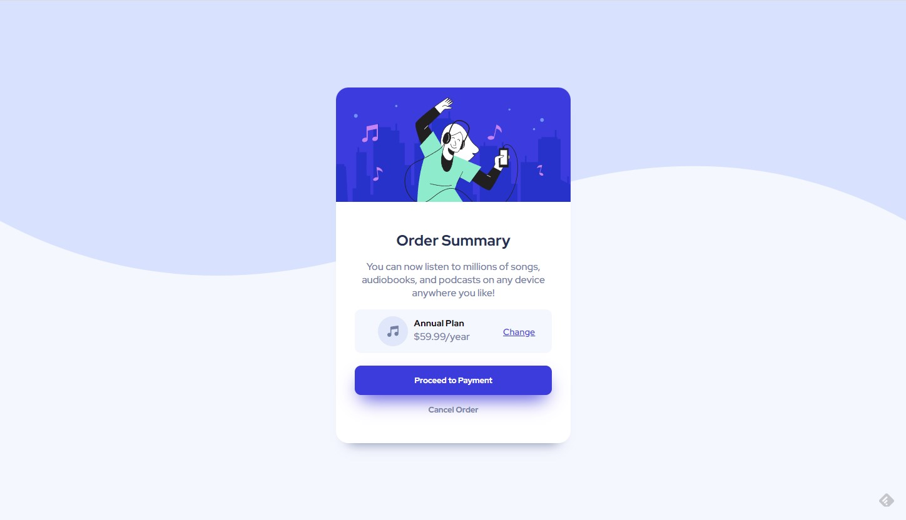

# Frontend Mentor - Order summary card solution

This is a solution to the [Order summary card challenge on Frontend Mentor](https://www.frontendmentor.io/challenges/order-summary-component-QlPmajDUj). Frontend Mentor challenges help you improve your coding skills by building realistic projects. 

## Table of contents

- [Frontend Mentor - Order summary card solution](#frontend-mentor---order-summary-card-solution)
  - [Table of contents](#table-of-contents)
  - [Overview](#overview)
    - [The challenge](#the-challenge)
    - [Screenshot](#screenshot)
    - [Links](#links)
  - [My process](#my-process)
    - [Built with](#built-with)
    - [What I learned](#what-i-learned)
    - [Continued development](#continued-development)
  - [Author](#author)

**Note: Delete this note and update the table of contents based on what sections you keep.**

## Overview

### The challenge

Users should be able to:

- See hover states for interactive elements

### Screenshot

### Links

- Solution URL: [Add solution URL here](https://your-solution-url.com)
- Live Site URL: [Netlify Live Site](https://order-summary-challenge-fm.netlify.app/)

## My process

### Built with

- Semantic HTML5 markup
- CSS custom properties
- Flexbox
- Visual Studio Code
- Open with Live Server (VS Code plugin)

### What I learned

This is my first challenge ever. I learned a lot how to use the Chrome Developer Tool (F12) and to turn on and off different style in order to understand better what each property does in the browser.

I realized I still have a long way to go, but I started to look up the documentation for padding, margin and other CSS properties.

### Continued development

I will go for the next challenge. 

## Author

- Website - [LBT Blog](https://littlebigtomatoes.com/)
- Frontend Mentor - [@gyurisc](https://www.frontendmentor.io/profile/gyurisc)
- Twitter - [@gyurisc](https://www.twitter.com/gyurisc)
